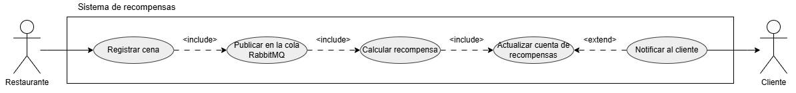
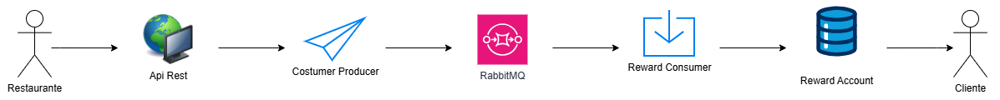
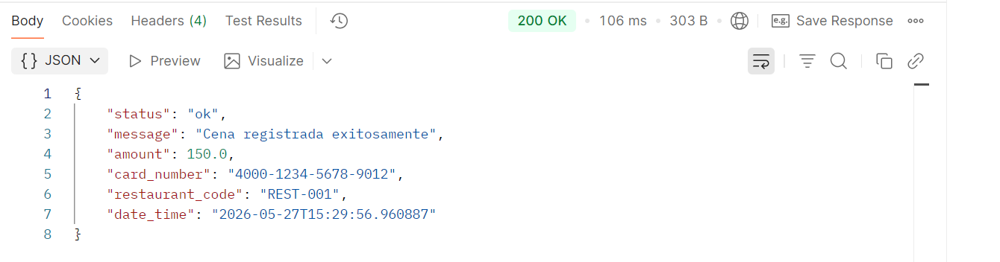
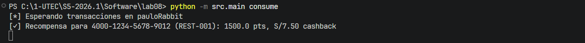
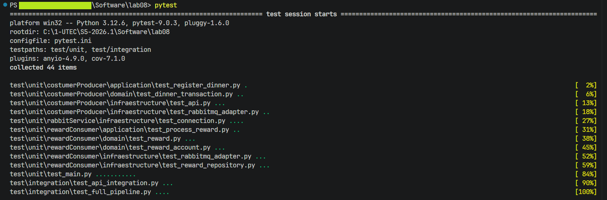
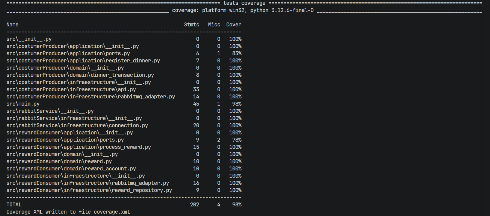
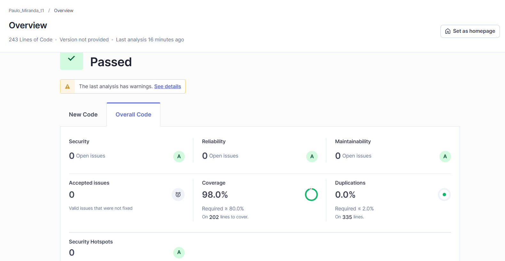

# 1. Sistema de Recompensas para Restaurantes

**UTEC - Departamento de Ciencia de la Computación**  
**CS3081 - Ingeniería de Software**  
**Lab 08: Buen Diseño - Cohesión y Acoplamiento**

---

### Sonar Qube

 - **SonarCloud**: [https://sonarqube.ingsoftware.lat/dashboard?id=Paulo_Miranda_t1&codeScope=overall](https://sonarqube.ingsoftware.lat/dashboard?id=Paulo_Miranda_t1&codeScope=overall)

## 2. Descripción

Sistema de fidelización basado en una **Arquitectura Orientada a Eventos (EDA)** que permite a restaurantes afiliados registrar consumos de clientes y calcular automáticamente puntos y cashback como recompensas. La comunicación entre componentes se realiza a través de **RabbitMQ**, garantizando bajo acoplamiento, alta cohesión y escalabilidad.

---

## 3. Casos de uso

El sistema involucra dos actores principales: el **Restaurante**, que registra los consumos de los clientes, y el **Cliente**, que acumula recompensas. El restaurante inicia el caso de uso *Registrar Cena*, que desencadena el cálculo automático de puntos y cashback, la actualización de la cuenta del cliente y, opcionalmente, el envío de una notificación.



---

## 4. Diagrama de Secuencia

El siguiente diagrama de secuencia muestra el flujo técnico del sistema: el restaurante envía los datos de la cena vía API REST, el **Producer** publica un evento en **RabbitMQ**, el **Consumer** lo recibe, calcula las recompensas y actualiza la cuenta del cliente.



---

## 5. Estructura del Proyecto

El proyecto sigue una **Arquitectura Hexagonal (Puertos & Adaptadores)**, separando claramente el dominio, la lógica de aplicación y la infraestructura.

### Componentes

| Componente | Rol |
|---|---|
| **Producer** (`costumerProducer`) | Publica eventos de transacción en RabbitMQ |
| **Consumer** (`rewardConsumer`) | Escucha eventos y calcula recompensas |
| **Connection Template** (`rabbitService`) | Proporciona la conexión compartida a RabbitMQ reutilizable por producer y consumer |

```
src/
├── main.py                          # CLI entry point
├── costumerProducer/                # Producer - Restaurant side
│   ├── domain/dinner_transaction.py # Value object (inmutable)
│   ├── application/ports.py         # Puerto MessageBroker
│   ├── application/register_dinner.py # Caso de uso
│   └── infraestructure/
│       ├── api.py                   # API REST (FastAPI)
│       └── rabbitmq_adapter.py      # Adaptador RabbitMQ
├── rabbitService/                   # Conexión compartida RabbitMQ
│   └── infraestructure/connection.py
└── rewardConsumer/                  # Consumer - Reward system
    ├── domain/
    │   ├── reward.py                # Value object (inmutable)
    │   └── reward_account.py        # Entidad cuenta de recompensas
    ├── application/ports.py         # Puerto RewardRepository
    ├── application/process_reward.py # Caso de uso
    └── infraestructure/
        ├── rabbitmq_adapter.py      # Consumidor RabbitMQ
        └── reward_repository.py     # Repositorio en memoria
```

---

## 6. Instalación

```bash
git clone <repo-url>
cd lab08
python -m venv .venv
.venv\Scripts\activate
pip install -r requirements.txt
```

### Configuración

Crear archivo `.env` basado en `.env.example`:

```env
RABBITMQ_HOST=localhost
RABBITMQ_PORT=5672
RABBITMQ_USER=tu_usuario
RABBITMQ_PASS=tu_password
RABBITMQ_VHOST=/
RABBITMQ_QUEUE=nombre_de_cola
```

---

## 7. Uso

### 1. Iniciar el servidor API REST

```bash
python -m src.main serve --port 8000
```

### 2. Iniciar el consumidor / receptor de mensajes

```bash
python -m src.main consume
```

### 3. Ejemplo. Publicar un evento vía API REST

```bash
curl -X POST http://127.0.0.1:8000/transactions \
  -H "Content-Type: application/json" \
  -d '{"amount": 150.0, "card_number": "4000-1234-5678-9012", "restaurant_code": "REST-001"}'
```



Resultados en el consume del mensajero `RabbitMQ`.



---

## 8. Pruebas

Para probar los test programados y generar el archivo `xml` para SonarQube ejecutar:

```bash
pytest
```

El proyecto incluye:

- **Pruebas unitarias**: Cada capa testeada de forma aislada (dominio, aplicación, infraestructura)
- **Pruebas de integración**: Pipeline completo con RabbitMQ real usando `testcontainers`
- **Cobertura objetivo**: ≥ 85%

Para subir los resultados a SonarCloud, ejecuta `sonar-scanner` si lo tienes instalado.

### Resultados de test automáticos





---

## 9. Calidad de Código - SonarCloud



El proyecto se analiza en SonarCloud evaluando:

- **Reliability** (Confiabilidad)
- **Security** (Seguridad)
- **Maintainability** (Mantenibilidad)
- **Duplications** (Duplicación de código)
- **Test Coverage** ≥ 85%

---

## 10. Tecnologías

- **Python 3.12+**
- **FastAPI** - API REST
- **RabbitMQ + Pika** - Mensajería
- **Testcontainers** - Pruebas de integración
- **Pytest + pytest-cov** - Pruebas y cobertura
- **SonarCloud** - Calidad de código
